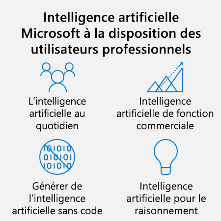
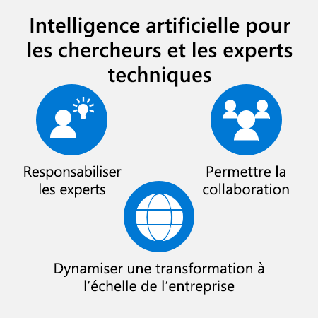

#  Susciter l’intérêt des utilisateurs professionnels à l’aide de cas d’utilisation clés sur l’intelligence artificielle (IA)

Ce module permettra aux responsables d’entreprises d’en savoir plus sur la vaste gamme d’outils et de technologies d’intelligence artificielle disponibles aujourd’hui pour les utilisateurs professionnels.

## Objectifs d’apprentissage

Dans ce module, vous allez :
* Penser à la façon dont les experts peuvent utiliser les modèles d’intelligence artificielle pour appliquer leur expertise.
* Identifier la manière dont les outils d’intelligence artificielle sans code peuvent aider les utilisateurs professionnels à créer et à personnaliser des modèles d’intelligence artificielle.
* Décrire comment les applications métier intelligentes peuvent transformer rapidement les principaux processus métier.
* Appliquer des expériences d’intelligence artificielle au quotidien pour aider les utilisateurs professionnels à être plus efficaces et plus productifs.

## Introduction à l’IA pour les utilisateurs professionnels

L’intelligence artificielle peut permettre à tous, pas seulement aux développeurs et aux scientifiques des données, d’aller encore plus loin. En fait, Gartner a prédit qu’en 2021, l’augmentation de l’intelligence artificielle (IA) créera 2,9 trillions de dollars de valeur commerciale et 6,2 milliards d’heures de productivité des travailleurs à l’échelle mondiale.1 La plus grande partie de cette énorme valeur proviendra des utilisateurs professionnels et des experts techniques qui utilisent l’intelligence artificielle.
 
Prenons l’exemple de Novartis. Novartis est une société pharmaceutique suisse qui dote la station de travail de chaque employé de la puissance de l’intelligence artificielle. Ses employés traitent de grandes quantités d’informations comme les publications biomédicales, l’imagerie cellulaire, les représentations moléculaires, les séquences de gènes et les résultats d’essais cliniques. Avec un éventail de modèles d’intelligence artificielle, les employés peuvent rapidement comprendre ces informations et en tirer des insights clés afin de faire face à la prochaine vague de défis dans le domaine médical.

Ce n’est qu’un exemple. L’intelligence artificielle offre aux utilisateurs professionnels et aux experts techniques des opportunités illimitées pour faire des choses qui n’étaient pas possibles auparavant. Grâce à l’accès à l’intelligence artificielle, ils peuvent découvrir des insights masqués, trouver des informations critiques, améliorer la collaboration et même automatiser des tâches répétitives.

## Perspective de Microsoft

Chez Microsoft, nous travaillons pour nous assurer que chaque utilisateur (du comptable au chercheur) puisse aller encore plus loin grâce à l’intelligence artificielle. Il ne devrait pas être nécessaire de disposer d’une formation dans la science des données pour tirer parti de ces expériences.

Nous pensons que l’intelligence artificielle doit être utilisée pour améliorer, sans remplacer, les capacités humaines. Les bons outils d’intelligence artificielle permettent aux employés de mieux appliquer leur expertise et de la compléter avec des insights dotés de l’intelligence artificielle, ce qui les rend plus novateurs et efficaces.

Pour ce faire, nous intégrons l’intelligence dans les applications métier que les gens utilisent quotidiennement.

Nous souhaitons également permettre à quiconque d’ajouter des fonctionnalités d’intelligence artificielle à des applications, quelle que soit leur expérience technique. Nous travaillons à démocratiser le développement de l’intelligence artificielle avec des outils et des plateformes sans code pour que les utilisateurs puissent créer leurs propres modèles d’intelligence artificielle. Nous proposons également des modèles prédéfinis pour les scénarios courants accessibles aux non-développeurs.

Enfin, nous nous engageons à faire progresser le développement et l’utilisation responsables de l’intelligence artificielle. Nous pensons qu’il est essentiel de prendre une approche axée sur l’humain en termes de développement et de gouvernance de l’intelligence artificielle. Cette approche doit accepter des perspectives différentes et mettre en évidence l’écoute, l’apprentissage et la réponse à mesure que la technologie évolue. Ensemble, nous pouvons nous assurer que la nouvelle génération de l’intelligence artificielle est conçue, générée et utilisée de manière responsable.

Ensuite, nous écouterons Navrina Singh, cofondatrice actuelle de Credo.ai et ex-directrice du service Product Management chez Microsoft AI, qui discutera des avantages de la mise à l’échelle de l’intelligence artificielle pour tous les membres d’une organisation.

## Vue d’ensemble

Regardez cette vidéo de Navrina Singh, cofondatrice actuelle de Credo.ai et ex-directrice du service Product Management chez Microsoft AI. Navrina Singh explique pourquoi la démocratisation de l’intelligence artificielle (IA) au sein d’une organisation est essentielle à sa réussite. Navrina Singh partage également des insights clés qui permettront aux responsables d’entreprises d’adapter l’intelligence artificielle à chaque employé.

[Le lien de la vidéo](https://docs.microsoft.com/fr-fr/learn/modules/enable-business-users-with-key-ai-uses-cases/3-executive-overview)

Pour réaliser une transformation IA complète, l’intelligence artificielle doit être mise à la disposition de chaque employé, quel que soit son rôle ou son expertise technique. Avec un accès à l’intelligence artificielle dans le cadre de leur travail quotidien, les utilisateurs professionnels et les experts techniques peuvent être plus productifs et exécuter des tâches qui n’étaient pas possibles auparavant.

Examinons certaines des fonctionnalités clés de l’intelligence artificielle que les employés de chaque secteur industriel peuvent utiliser dans leur travail quotidien.

## Intelligence artificielle pour le raisonnement

Aujourd’hui, un grand nombre de modèles d’intelligence artificielle sont disponibles. Toutefois, la plupart des travailleurs ont uniquement accès aux modèles qui ont été incorporés dans des applications à des fins spécifiques. Dans les domaines complexes qui nécessitent une expertise approfondie, les employés ont besoin de la flexibilité nécessaire pour faire pivoter leur approche s’ils ont une nouvelle idée ou de nouvelles preuves à utiliser. Indiquer à l’avance à un développeur ou à un scientifique des données ce qui est requis serait peu pratique et sans doute impossible.

La véritable transformation se produit lorsque tout le monde peut utiliser un large éventail de modèles d’intelligence artificielle afin de raisonner sur des informations complexes non structurées. Cela signifie qu’ils peuvent choisir les modèles d’intelligence artificielle à utiliser à des fins différentes et les sources d’informations à analyser avec ces modèles.

C’est en cela que consiste l’intelligence artificielle pour le raisonnement. Elle est très utile pour les personnes ayant une expertise stratégique, comme les chercheurs, les responsables des opérations, les techniciens sur le terrain, les responsables marketing, les développeurs d’activité, etc. Grâce à des applications puissantes d’intelligence artificielle, ils peuvent appliquer leurs connaissances de manière plus efficace, accélérer les itérations du cycle d’apprentissage et fournir un impact commercial réel à un rythme jamais atteint auparavant.

## Mackmyra

[Mackmyra Whisky](https://news.microsoft.com/europe/features/meet-the-worlds-first-ai-created-whisky/), un distillateur de whisky suédois, utilise l’intelligence artificielle pour le raisonnement afin d’aider ses Master Blenders à produire une qualité de niveau supérieur. Les modèles d’intelligence artificielle de Mackmyra utilisent des recettes, des données de vente et des préférences client existantes pour générer plus de 70 millions de recettes de whisky nouvelles et innovantes. Les Master Blenders évaluent, testent et affinent les recommandations de l’intelligence artificielle en fonction de leur expertise et de leurs connaissances approfondies dans le domaine. Grâce à la puissance de l’intelligence artificielle, ils peuvent innover à un rythme et avec un niveau de détail qui étaient auparavant inaccessibles.
