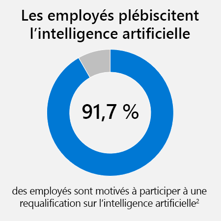

#  Susciter l’intérêt des utilisateurs professionnels à l’aide de cas d’utilisation clés sur l’intelligence artificielle (IA)

Ce module permettra aux responsables d’entreprises d’en savoir plus sur la vaste gamme d’outils et de technologies d’intelligence artificielle disponibles aujourd’hui pour les utilisateurs professionnels.

## Objectifs d’apprentissage

Dans ce module, vous allez :
* Penser à la façon dont les experts peuvent utiliser les modèles d’intelligence artificielle pour appliquer leur expertise.
* Identifier la manière dont les outils d’intelligence artificielle sans code peuvent aider les utilisateurs professionnels à créer et à personnaliser des modèles d’intelligence artificielle.
* Décrire comment les applications métier intelligentes peuvent transformer rapidement les principaux processus métier.
* Appliquer des expériences d’intelligence artificielle au quotidien pour aider les utilisateurs professionnels à être plus efficaces et plus productifs.

## Introduction à l’IA pour les utilisateurs professionnels

L’intelligence artificielle peut permettre à tous, pas seulement aux développeurs et aux scientifiques des données, d’aller encore plus loin. En fait, Gartner a prédit qu’en 2021, l’augmentation de l’intelligence artificielle (IA) créera 2,9 trillions de dollars de valeur commerciale et 6,2 milliards d’heures de productivité des travailleurs à l’échelle mondiale.1 La plus grande partie de cette énorme valeur proviendra des utilisateurs professionnels et des experts techniques qui utilisent l’intelligence artificielle.
 
Prenons l’exemple de Novartis. Novartis est une société pharmaceutique suisse qui dote la station de travail de chaque employé de la puissance de l’intelligence artificielle. Ses employés traitent de grandes quantités d’informations comme les publications biomédicales, l’imagerie cellulaire, les représentations moléculaires, les séquences de gènes et les résultats d’essais cliniques. Avec un éventail de modèles d’intelligence artificielle, les employés peuvent rapidement comprendre ces informations et en tirer des insights clés afin de faire face à la prochaine vague de défis dans le domaine médical.

Ce n’est qu’un exemple. L’intelligence artificielle offre aux utilisateurs professionnels et aux experts techniques des opportunités illimitées pour faire des choses qui n’étaient pas possibles auparavant. Grâce à l’accès à l’intelligence artificielle, ils peuvent découvrir des insights masqués, trouver des informations critiques, améliorer la collaboration et même automatiser des tâches répétitives.

